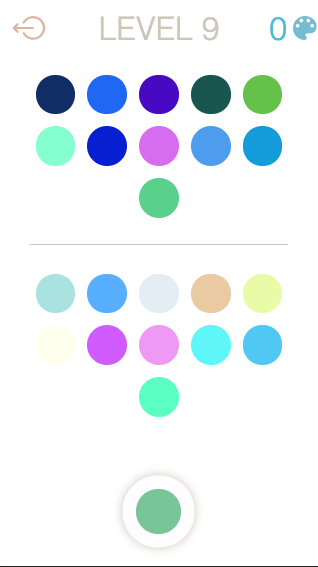

# PALETTE

## Juego casual de **PilPilGames**

Primer juego casual de este estudio, consiste en un juego de puzzles en el que el usuario ha de
mezclar colores para pasar de nivel.

Se encuentra en pleno proceso de desarrollo, utilizando únicamente tecnologías web. En el futuro no
se descarta la posibilidad de migrar a un entorno Unity, Phaser, etc.

### TODO

-   [x] Colores casi blancos
-   [x] Colores muy parecidos
-   [x] Bajar a local
-   [x] Persistir record (**Nota:** tambien estamos persistiendo el nivel actual)
-   [x] Cambiar el grid de Gridlayout a Flexbox
-   [x] Dar feedback del error
-   [x] Relacionado con tutorial y curva de aprendizaje: Modificar el sistema de niveles, para que
        el primer nivel tenga un solo círculo (aprender a arrastrar objetos sin frustraciones), el
        segundo con dos (ir cogiendo poco a poco la mecánica de colores), el tercero tres... y así
        hasta el nivel 15
-   [x] Explicativo al principio (flechas, tutorial...) -> Pintada, el funcionamiento es el
        siguiente: La primera vez que se usa el juego, el componente .active\_\_base tiene añadida
        la clase .tutorial. En el momento en el que se empieza a arrastrar el color activo, esta
        clase desaparece y todos los mixers reciben la clase .tutorial. En el momento en el que se
        suelta el primer activo sobre un mixer, desaparece la clase .tutorial de los mixers y no
        vuelve a aparecer en ningún componente.
-   [x] Hack en las unidades vh para evitar el descuadre por la barra de navegación
-   [x] Logo de Pil-Pil Games incluido en el juego
-   [X] Introducir elementos para facilitar comprensión del juego (líneas que relacionan muestras y mixers)
-   [x] Refactor CSS variables en progression for.
-   [x] Cuando se falla un color, emplear la clase .reset-swatch para resetear los demás colores (actualmente se utilizan las clases .match-swatch y .match-mixer, que tienen un pseudoelemento ::after para indicar cuándo se acierta).
-   [ ] Música ambient / chill 
-   [ ] Efectos de sonido: Cada vez que se consigue un match de color / Cuando hay un error / Cuando
        se pasa de nivel
-   [x] Home -> Pintada, falta funcionalidad en botones reset y about (acceder a las secciones, que están ocultas)y en sonido (conmutar entre sonido y silencio)
-   [x] Reset del juego -> Pintada, falta funcionalidad (borrar localstorage)
-   [x] Compartir resultado -> Pintada, falta generar dinámicamente el enlace con el resultado
-   [x] Visualizar progresión del juego -> Está pintado, con la progresión pintada mediante css. Únicamente sería necesario añadir las clases .level-1, .level-2... al elemento .progression, pero tal vez quieras refactorizar en js el funcionamiento (lo he adelantado así para ahorrarte trabajo por si acaso)
-   [x] Recompensa visual entre niveles (¿Quotes de artistas?)-> Pintada y creado quotes.json, un
        archivo con 40 frases para alimentarlas.
-   [ ] Pantalla final del juego, cuando se superan los 15 niveles -> Pintada, falta incorporar funcionalidad (aparición al superar el nivel 15, botón de compartir resultado)
-   [ ] Integrar sistema de monetización. Idea: donativos voluntarios através de esta plataforma (botón en los créditos y cuando te pasas el juego): https://www.buymeacoffee.com/). Es sencillo, pega mucho con el rollo "creativo" que llevamos y sólo supone un 5% de comisión. -> Pintado, faltaría crear la cuenta y linkar a la página de pagos.
-   [ ] Mínimos de luminosidad para mixers (15) y para swatches (25)
-   [ ] Mínimo de diferencial en la generación del mixer (de 0 a 0.9 ?)
-   [ ] Limitar el número máximo de veces (10) que se ejecuta la condicional de diferencia de
        colores, para evitar el bug de bucle infinito
-   [x] Hacer que el contador de colores sea por color activo generado (en lugar de por match, así hacemos que el pique sea a ver quién se pasa el juego con menos colores)
-   [ ] Hacer testing con usuarios
-   [ ] Sistema para registrar datos del testing automáticamente (?)

### ROADMAP

-   [ ] Monetización
-   [ ] Compartir en redes
-   [ ] Marketing de guerrilla
-   [ ] Crowfunding

### MODELO DE MONETIZACIÓN

Esto es una idea, que tendremos que testar y discutir. Con este juego tenemos dos objetivos: La
rentabilidad económica y comenzar a hacer "ruido" como estudio de videojuegos. Por este último
motivo es necesario que el juego sea una experiencia totalmente disfrutable por sí mismo, de forma
independiente a su monetización. La publicidad es intrusiva y nos va a hacer perder usuarios, y el
modelo freemium puro hace que el juego tenga un recorrido muy corto. Por eso propongo esta idea:

-   El juego Palette se ofrece íntegro, sin publicidad ni necesidad de micropagos para disfrutar al
    100% de sus prestaciones. La única limitación es que los usuarios tienen limitado el número de
    "activos" que se generan (una cantidad suficiente como para pasarse los 15 niveles del juego,
    tal vez 300 o 500)
-   El juego Palette Unlimited, por otro lado, no tiene esta limitación y presenta algún tipo de
    funcionalidad extra (combos, otros tipos de niveles o mecánicas, etc.). Cuando un usuario se
    queda sin colores, recibe una notificación con estas ventajas, para motivarle a la compra por un
    precio muy razonable (0,99€) Con este modelo nos ahorramos bastantes problemas, así a bote
    pronto, se me ocurren:
-   Evitamos las restricciones legales de los freemium (autorizaciones para microcompras, validación
    de edad, etc), así como el desarrollo necesario para articular el sistema de micropagos.
-   Quitamos cualquier barrera para que el juego se difunda por sí mismo, sin nada que interfiera en
    una experiencia satisfactoria.
-   Prolongamos la vida del juego a través de su segunda versión. En la versión sencilla de Palette
    hemos educado el ojo del usuario, y le hemos motivado haciendo que sea cada vez mejor. Sobre esa
    base, en la versión Unlimited podemos construir experiencias más complejas que lleven más allá
    la experiencia de juego (por ejemplo, que el match de colores sea una herramienta para resolver
    otro tipo de rompecabezas, o integrar el juego competitivo...)
-   La idea es que la versión Unlimited tendría un evolutivo a futuro, mientras que la Básica es lo
    que es.
